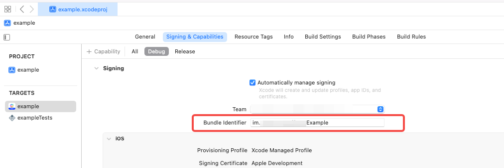

# Zego Effects Demo for React Native

* [中文](README_CN.md)
* [API](https://doc-zh.zego.im/article/21358)

## Usage Instructions

**I. Download Resources and Import to Your Project**

Download the latest version of the Effects SDK from the SDK download website (iOS download link: [https://doc-zh.zego.im/article/15898](https://doc-zh.zego.im/article/15898), Android download link: [https://doc-zh.zego.im/article/15899](https://doc-zh.zego.im/article/15899)). After extracting, import the `Resources` and `Models` folders into your project.

**Note:**: You only need to add the resources and models to your project; `@zegocloud/zego-effects-reactnative` will automatically download the SDK itself.

* **iOS**: Add the `Resources` and `Models` folders to your Xcode project and select the option to create a folder reference in the group settings. Assuming your project is named `example` and you have placed all resources in the `Assets` folder, your project directory structure should look like this after import:

  

* **Android**: Add the `Resources` and `Models` folders to your Android project's `assets` directory. Typically, resources should be placed in the `android/app/src/main/assets` directory, so your project directory structure should look like this after import:

  

**II. Configure AppID and AppSign**

Rename `KeyCenter.js.example` to `KeyCenter.js` and modify the `appID` and `appSign` to the values obtained from your Zego console application.


Also, change the `applicationID` of the Android project and the `bundlerID` of the iOS project to the corresponding values filled in when applying for `Effects` (Zego's technical support staff will assist with the application and configuration).

* `android/app/build.gradle`

  

* `ios/example.xcodeproj`

  

**III. Install Dependencies and Run**

```bash
# Install dependencies
yarn

# Run iOS
cd ios
export NODE_BINARY=$(command -v node) > .xcode.env.local
pod repo update
pod install 
yarn ios

# Run Android
yarn android
```