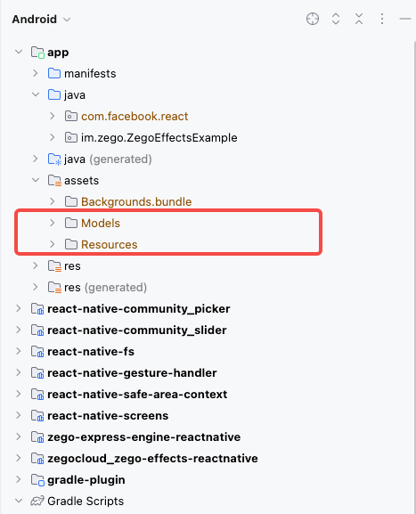

# Zego Effects Demo for React Native

* [English](README.md)
* [API](https://zego-effects-reactnative.vercel.app/)

## 使用说明

**一、下载资源并导入到项目**

从SDK下载网站下载最新版本的Effects SDK（iOS下载链接：[https://doc-zh.zego.im/article/15898](https://doc-zh.zego.im/article/15898)，Android下载链接：[https://doc-zh.zego.im/article/15899](https://doc-zh.zego.im/article/15899)）。解压后，将 `Resources` 和 `Models` 文件夹导入到你的项目中。

注意：你只需要将资源和模型添加到你的项目中；`@zegocloud/zego-effects-reactnative`会自动下载SDK本身。

* **iOS**：将 `Resources` 和 `Models` 文件夹添加到你的Xcode项目中，并在组设置中选择创建文件夹选项。假设你的项目名为 `example` ，并且你将所有资源放在 `Assets` 文件夹中，导入后你的项目目录结构应该如下所示：

  

* **Android**：将 `Resources` 和 `Models` 文件夹添加到你的Android项目的 `assets` 目录中。通常，资源应该放置在 `android/app/src/main/assets` 目录中，所以导入后你的项目目录结构应该如下所示：

  

**二、配置AppID和AppSign**

把 `KeyCenter.js.example` 重命名为 `KeyCenter.js` ，并把其中的 `appID` 和 `appSign` 修改成在即构控制台申请的值。


同时也要把android工程的 `applicationID` 和ios工程的 `bundlerID` 改成申请开通 `Effects` 时填的对应的值（即构的技术支持人员会协助申请和配置）。

* `android/app/build.gradle`

  

* `ios/example.xcodeproj`

  


**三、安装依赖和运行**

```bash
yarn

# 运行ios
cd ios
export NODE_BINARY=$(command -v node) > .xcode.env.local
pod repo update
pod install 
yarn ios

# 运行android
yarn android

```

